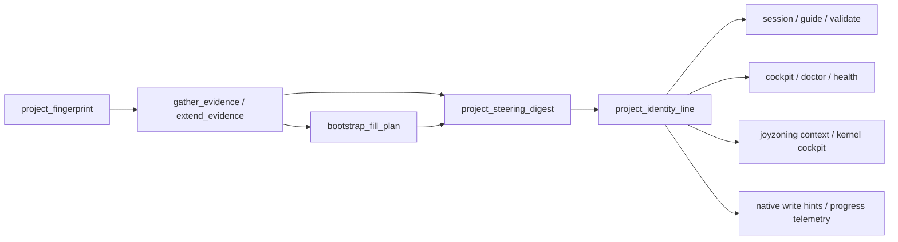

# Auto-rolling roadmap checkpoint

Per-project steering for `ROADMAP.md` — the living product, architecture, and
long-horizon checkpoint file. The roadmap is **not** a backlog or wishlist; it is
the authority surface agents and operators use to answer:

- What is this project becoming?
- What matters now?
- What should happen next?
- Is the system becoming more coherent or more fragmented?

Every roadmap tool response is **unique to the workspace** it resolves. Generic
template text is detected, evidence-backed replacements are suggested, and a
compact identity line travels with every JSON payload so agents never steer a
Hermes plugin checkout as if it were the user's project.

Skill file (auto-installed when enabled):
`optional-skills/dietcode/auto-rolling-roadmap/SKILL.md`

---

## Quick loops

### Operator

```text
1. /roadmap cockpit                    → health, schema, code soup, next action
2. /roadmap doctor                     → install skill + production checks
3. /roadmap explain-gate               → closed gates blocking kanban_complete
4. roadmap(action='checkpoint')        → evidence + algorithm before edits
5. roadmap(action='apply_bootstrap_fill', context='write')  → when placeholders remain
6. roadmap(action='validate')          → schema gate after ROADMAP.md edits
7. /roadmap progress --current         → full progress + gate snapshot JSON
```

### Agent

```text
1. roadmap(action='guide')             → phase, identity, operator hints
2. roadmap(action='checkpoint')        → evidence bundle + bootstrap_fill_plan
3. roadmap(action='apply_bootstrap_fill') → preview or write evidence autofill
4. Edit ROADMAP.md at workspace root only
5. roadmap(action='validate')          → confirm schema + bootstrap completeness
6. Return checkpoint summary (not the full file unless asked)
```

Prime directive every pass: **did the latest work strengthen or weaken the
project's center of gravity?**

---

## Per-project identity architecture

Roadmap ergonomics mirror industry patterns (Backstage entity cards, CI catalog
metadata, repo-level agent rules) by building a **project fingerprint** on every
workspace scan and attaching it to all agent-facing surfaces.



### Layer 1 — `project_fingerprint`

Built by `lib/agent/roadmap/project_fingerprint.py` from repo files (cached with
mtime invalidation). Signals include:

| Category | Fields | Sources |
| --- | --- | --- |
| **Identity** | `project_name`, `readme_title`, `readme_tagline`, `steering_brief`, `steering_identity`, `purpose_hint` | README, package manifests, Backstage catalog |
| **Stack** | `primary_language`, `frameworks`, `stack_summary`, `project_archetype`, `package_managers` | File markers, layout heuristics |
| **Verify** | `verification_commands`, `makefile_targets`, `entry_points`, `test_frameworks` | Makefile, `package.json` scripts, pytest/Jest/Vitest markers |
| **CI / delivery** | `ci_systems`, `ci_workflow_names`, `has_pre_commit`, `dependency_automation` | GitHub Actions, GitLab CI, Renovate, Dependabot, pre-commit |
| **Quality** | `quality_tools` | Biome, ESLint, Ruff, Prettier, mise, EditorConfig |
| **Governance** | `governance_files`, `agent_rules_files`, `issue_templates`, `has_codeowners` | SECURITY.md, AGENTS.md, `.cursor/rules`, issue/PR templates |
| **Runtime** | `compose_services`, `runtime_versions`, `runtime_center_hint`, `has_docker` | Docker Compose, `.nvmrc`, `.python-version` |
| **Monorepo** | `monorepo_tools`, `workspace_packages` | Turborepo, Nx, pnpm/npm workspaces |
| **Origin** | `git_remote`, `docs_roots`, `license` | `git remote`, docs/ tree |
| **Backstage** | `has_backstage_catalog`, `catalog_name`, `catalog_description` | `catalog-info.yaml` |

Archetypes: `project`, `library`, `application`, `web-app`, `cli-tool`,
`hermes-plugin`, `monorepo`.

### Layer 2 — evidence bundle

`gather_evidence()` / `extend_evidence()` (`lib/agent/roadmap/evidence.py`) attach:

- README / architecture / config excerpts (tier `standard`+)
- Git history, parsed ROADMAP.md, TODO markers, `code_soup_audit` (tier `full`)
- **`project_steering_digest`** and **`project_identity_line`** on every bundle

Evidence tiers:

| Tier | Includes |
| --- | --- |
| `light` | Workspace path, git summary, roadmap parse, fingerprint + steering profile |
| `standard` | + README/arch/config excerpts, uncertainty notes |
| `full` | + TODO scan, code soup audit (checkpoint default) |

### Layer 3 — `project_steering_digest`

Compact entity card from `build_project_steering_digest()` in
`lib/agent/roadmap/bootstrap_fill.py`. Always present when a workspace resolves.
Includes stack, verify commands, CI, quality tools, governance, bootstrap status,
and **`identity_line`** (same content as top-level `project_identity_line`).

When bootstrap placeholders remain, the digest also carries:

- `bootstrap_remaining`, `sample_fill_task`, `agent_next_call`

### Layer 4 — `project_identity_line`

One-line steering header for watch lines, cockpit headers, health output, and
agent skimming:

```text
Audit Project — Purpose line. · Python, make · verify `make verify`
```

Built by `format_steering_identity_line()` from brief, stack, primary verify
command, and optional runtime pin (e.g. `node 20`).

**Contract:** every roadmap JSON response exposed through `clarity_envelope()`
includes top-level `project_identity_line` plus nested
`project_steering_digest.identity_line`.

---

## Bootstrap fill (evidence autofill)

New projects receive a schema-complete skeleton from `bootstrap_skeleton_from_evidence()`.
Template guidance phrases remain until replaced with project-specific facts.

### Placeholder detection

`BOOTSTRAP_PLACEHOLDER_PHRASES` in `lib/agent/roadmap/schema.py` lists boilerplate
lines agents must replace (e.g. "Describe from README and project evidence").
`find_bootstrap_placeholders()` counts unresolved phrases; gates treat
`bootstrap_complete: false` as closed until resolved.

### Fill plan

`build_bootstrap_fill_plan()` maps each placeholder →:

| Field | Meaning |
| --- | --- |
| `template_phrase` | Exact skeleton line |
| `suggested_replacement` | Evidence-backed text (never identical to template) |
| `evidence_source` | Which signal produced it (README, fingerprint, git, code_soup, …) |

No `manual —` dead-ends: `_fallback_replacement()` chains purpose → operators →
runtime → stack → entry points → git remote → archetype.

### Apply autofill

| Call | Behavior |
| --- | --- |
| `roadmap(action='apply_bootstrap_fill')` | Preview replacements |
| `roadmap(action='apply_bootstrap_fill', context='preview')` | Same — no disk write |
| `roadmap(action='apply_bootstrap_fill', context='write')` | Write ROADMAP.md, mark `validation_pending` |
| `roadmap(action='checkpoint', context='apply autofill preview')` | Checkpoint + fill plan + preview (no write) |
| `roadmap(action='checkpoint', context='apply autofill write')` | Checkpoint + apply + autofill result |

After write: `roadmap(action='validate')` to persist schema gate.

---

## Tool actions

Native Hermes toolset: **`roadmap`** (alias **`roadmap_checkpoint`**).

| Action | Purpose |
| --- | --- |
| `guide` | Phase, health, `steering_line`, `project_identity_line`, `_roadmap_operator_hints` |
| `checkpoint` | Full evidence + algorithm + optional autofill; primary pre-edit briefing |
| `validate` | Schema validation; persists `.dietcode/roadmap-state.json` |
| `template` | Bootstrap skeleton when ROADMAP.md missing |
| `apply_bootstrap_fill` | Evidence autofill preview/write |
| `cockpit` | One-screen operator summary |
| `doctor` | Skill install + production health checks |
| `status` | Read-only ROADMAP.md parse |
| `evidence` | Read-only project signals |
| `progress` | Activity summary; `context='--current'` for full JSON |
| `watch` | Compact last-action line |
| `explain_gate` | Closed gates, fixes, kanban policy |
| `explain_stale` | Checkpoint freshness vs git activity |
| `last_error` | Last failure envelope |

Slash commands: `/roadmap cockpit`, `/roadmap doctor`, `/roadmap explain-gate`,
`/rm validate`, `/dietcode roadmap`, `/dietcode roadmap cockpit`.

---

## Response contract (agent JSON)

Every `clarity_envelope()` response includes:

| Field | Always | When bootstrap incomplete |
| --- | --- | --- |
| `project_identity_line` | ✓ | ✓ |
| `project_steering_digest` | ✓ | ✓ + `bootstrap_remaining`, `sample_fill_task` |
| `steering_line` | ✓ | ✓ |
| `_roadmap_operator_hints` | ✓ | ✓ + autofill next step |
| `bootstrap_fill_plan` | — | ✓ |
| `bootstrap_autofill_preview` | — | preview contexts |
| `recommended_next_action` | when computed | prioritizes `apply_bootstrap_fill` |

Operator hints include: `write_guard`, `roadmap_path`, `verification_commands`,
`next_action`, `recovery_suggestion`, `suggested_slash_command`.

Native `write_file` / `patch` on `ROADMAP.md` receive `_roadmap_write_hint` with
digest, identity line, and validate follow-up via
`merge_roadmap_hint_into_result()`.

---

## Phases

Determined by `determine_phase()` in `lib/agent/roadmap/phase_guide.py`:

| Phase | Meaning | Typical next call |
| --- | --- | --- |
| `bootstrap` | ROADMAP.md missing | `roadmap(action='checkpoint')` |
| `bootstrap_fill` | Placeholders remain | `roadmap(action='apply_bootstrap_fill', context='write')` |
| `structure_repair` | Missing required sections | Edit ROADMAP.md, then validate |
| `coherence_recovery` | Health not Coherent | Checkpoint + section 9 audit |
| `validate_pending` | File mutated since last validate | `roadmap(action='validate')` |
| `checkpoint` | Ready for rolling update | checkpoint → edit → validate |

---

## Steering gates

`lib/agent/roadmap/gate.py` evaluates gates before `kanban_complete`:

| Gate | Closes when |
| --- | --- |
| `workspace_safe` | Workspace is plugin/kernel/quarantine root |
| `roadmap_present` | ROADMAP.md missing |
| `schema_valid` | Validation errors or incomplete sections |
| `bootstrap_complete` | Bootstrap placeholder phrases remain |
| `checkpoint_fresh` | Section 11 stale vs git activity |
| `validation_pending` | ROADMAP.md edited since last validate |

Gate messages include **project steering brief** from fingerprint (not generic text).
When bootstrap is incomplete, schema gate fix prioritizes `apply_bootstrap_fill`.

Config (`dietcode.roadmap` in Hermes config):

| Key | Default | Effect |
| --- | --- | --- |
| `enabled` | `true` | Master switch |
| `auto_install_skills` | `true` | Copy skill to workspace on session/doctor |
| `warn_on_stale_before_complete` | `true` | Block kanban_complete on stale checkpoint |
| `block_kanban_on_validation_pending` | `true` | Block kanban_complete until validate |
| `progress_enabled` | `true` | JSONL telemetry |

---

## Native integration

### JoyZoning

- `joyzoning(action='context')` → `roadmap_checkpoint` brief, `project_steering_digest`,
  `project_identity_line`, merged `next_actions` (path hint, identity, verify, autofill)
- `joyzoning(action='roadmap')` → full cockpit payload

### Hooks

| Hook | Roadmap behavior |
| --- | --- |
| `session.start` | Session brief with steering digest |
| `pre_tool_call` | Block ROADMAP writes outside workspace; stale/validation gates on kanban_complete |
| `post_tool_call` | `roadmap.*` events; progress telemetry with `project_identity_line` |
| `on_write_transform` | `_roadmap_write_hint` on ROADMAP.md paths |

### Kernel cockpit

`/dietcode kernel cockpit` merges `session_brief()` into `roadmap_steering`:
Project, Identity, Verify, bootstrap fill guidance when incomplete.

### Health

`/dietcode doctor` and `/dietcode roadmap` JSON include `project_identity_line`,
`project_steering_digest`, and recommended next action.

---

## Progress and state

| Path | Purpose |
| --- | --- |
| `~/.dietcode/session/roadmap-progress.jsonl` | Append-only tool activity |
| `~/.dietcode/session/roadmap-progress-current.json` | Latest action snapshot |
| `.dietcode/roadmap-state.json` | Workspace validate/checkpoint memory |

Workspace state tracks: `phase`, `schema_valid`, `validation_pending`,
`last_validated_at`, `last_mutated_at`, `bootstrap_placeholder_count`.

---

## Module map

```text
lib/agent/roadmap/
  project_fingerprint.py   Per-repo identity signals (cached)
  evidence.py              gather_evidence, extend_evidence, steering on bundle
  bootstrap_fill.py        fill plan, digest, identity_line, autofill write
  steering_context.py      Unified steering + enrich_payload_with_steering
  roadmap_checkpoint.py    checkpoint, validate, template orchestration
  phase_guide.py           clarity_envelope, phases, playbooks
  operator.py              recommend_next_action, operator hints
  agent_steering.py        Live steering_line for prompts and session
  gate.py                  Gate evaluation + personalized messages
  session.py               session_brief for session.start / cockpit
  cockpit.py               One-screen operator payload + report
  doctor.py                Production health checks
  explain_gate.py          Gate diagnostics
  progress.py              Watch/progress telemetry
  native_bridge.py         Write hints, merge into tool results
  schema.py                12-section contract, placeholders, skeleton
  workspace_scan.py        TODO markers, source walk
  code_soup_audit.py       Duplication / authority fragmentation signals

lib/runtime/roadmap_hooks.py   Hermes hook wiring
lib/tools/roadmap_tools.py     Tool dispatch
scripts/roadmap_audit.py       Production hardening audit
scripts/roadmap_operator_smoke.py
scripts/roadmap_smoke.py
tests/test_roadmap_checkpoint.py
tests/test_kernel_cockpit.py   Kernel + roadmap steering merge
```

---

## Verification

Production gate for roadmap changes:

```bash
make verify
```

Runs:

1. `scripts/roadmap_smoke.py`
2. `scripts/roadmap_audit.py` — fingerprint, autofill, identity on all surfaces,
   joyzoning merge, kernel cockpit, gate personalization
3. `scripts/roadmap_operator_smoke.py`
4. `tests/test_roadmap_checkpoint.py` + `tests/test_kernel_cockpit.py`

---

## Troubleshooting

| Symptom | Likely cause | Fix |
| --- | --- | --- |
| Generic steering / wrong project | Workspace resolves to plugin root | `export HERMES_KANBAN_WORKSPACE=/path/to/project` |
| `bootstrap_complete: false` | Template phrases remain | `roadmap(action='apply_bootstrap_fill', context='write')` then validate |
| kanban_complete blocked | Stale checkpoint or validation pending | `/roadmap explain-gate` |
| ROADMAP write blocked | Path outside workspace | Write only at project root `ROADMAP.md` |
| Missing skill | Auto-install disabled | `roadmap(action='doctor')` or copy skill manually |
| No `project_identity_line` | Roadmap disabled or unresolved workspace | `/dietcode roadmap` doctor output |

---

## Related

- [agent-ergonomics.md](agent-ergonomics.md) — kernel + roadmap operator UX
- [tools-reference.md](tools-reference.md) — slash command catalog
- [architecture.md](architecture.md) — hook wiring and gate integration
- [../optional-skills/dietcode/auto-rolling-roadmap/SKILL.md](../optional-skills/dietcode/auto-rolling-roadmap/SKILL.md) — agent skill contract
