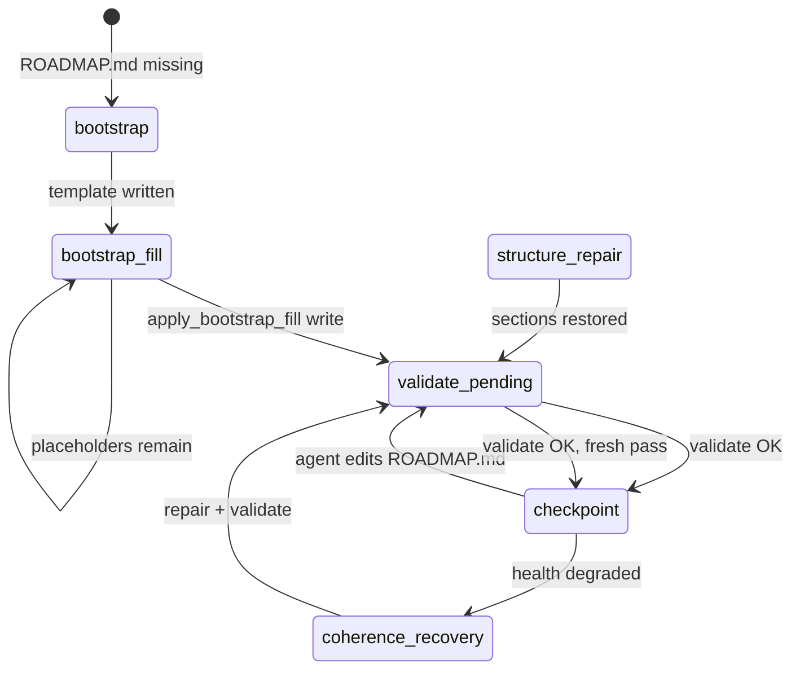
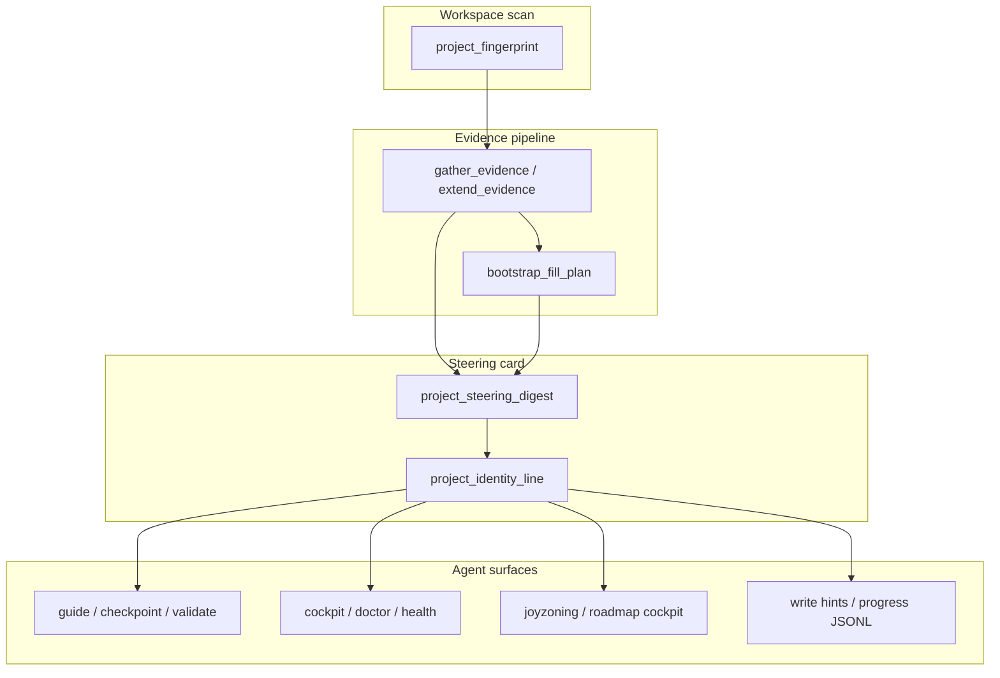
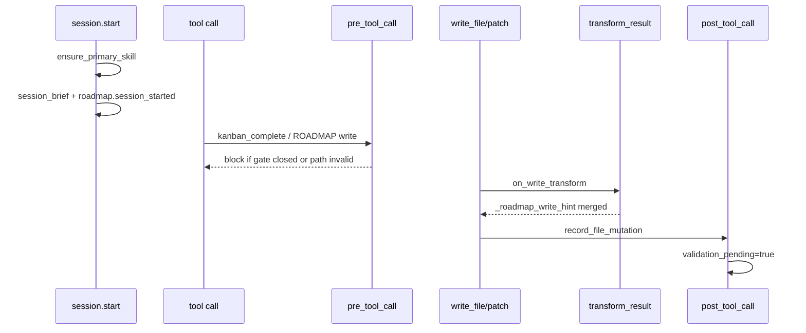

# Auto-rolling roadmap checkpoint

Per-project steering for `ROADMAP.md` — the living product, architecture, and
long-horizon checkpoint file. The roadmap is **not** a backlog or wishlist; it is
the authority surface agents and operators use to answer:

- What is this project becoming?
- What matters now?
- What should happen next?
- Is the system becoming more coherent or more fragmented?

Every roadmap tool response is **unique to the workspace** it resolves. Generic
template text is detected, evidence-backed replacements are suggested, and a
compact identity line travels with every JSON payload so agents never steer a
Hermes plugin checkout as if it were the user's project.

Skill file (auto-installed when enabled):
`optional-skills/dietcode/auto-rolling-roadmap/SKILL.md`

---

## Contents

1. [Quick loops](#quick-loops)
2. [End-to-end lifecycle](#end-to-end-lifecycle)
3. [ROADMAP.md document contract](#roadmapmd-document-contract)
4. [Per-project identity architecture](#per-project-identity-architecture)
5. [Bootstrap fill (evidence autofill)](#bootstrap-fill-evidence-autofill)
6. [Tool actions](#tool-actions)
7. [Response contract (agent JSON)](#response-contract-agent-json)
8. [Example payloads](#example-payloads)
9. [Phases and next-action logic](#phases-and-next-action-logic)
10. [Steering gates](#steering-gates)
11. [Workspace resolution](#workspace-resolution)
12. [Configuration reference](#configuration-reference)
13. [Native integration](#native-integration)
14. [Write guard and native hints](#write-guard-and-native-hints)
15. [Progress, state, and telemetry](#progress-state-and-telemetry)
16. [Code soup audit](#code-soup-audit)
17. [Module map](#module-map)
18. [Verification](#verification)
19. [Troubleshooting](#troubleshooting)
20. [Anti-patterns](#anti-patterns)
21. [Slash command reference](#slash-command-reference)
22. [Checkpoint freshness algorithm](#checkpoint-freshness-algorithm)
23. [Kanban and JoyZoning integration](#kanban-and-joyzoning-integration)
24. [Hook lifecycle and journal events](#hook-lifecycle-and-journal-events)
25. [Section authoring guide](#section-authoring-guide)
26. [Required final assistant response](#required-final-assistant-response)
27. [Skill installation](#skill-installation)
28. [Contributor guide](#contributor-guide)

---

## Quick loops

### Operator

```text
1. /roadmap cockpit                    → health, identity, schema, code soup, next action
2. /roadmap doctor                     → install skill + production checks
3. /roadmap explain-gate               → closed gates blocking kanban_complete
4. roadmap(action='checkpoint')        → evidence + algorithm before edits
5. roadmap(action='apply_bootstrap_fill', context='write')  → when placeholders remain
6. roadmap(action='validate')          → schema gate after ROADMAP.md edits
7. /roadmap progress --current         → full progress + gate snapshot JSON
```

### Agent

```text
1. roadmap(action='guide')             → phase, identity, operator hints
2. roadmap(action='checkpoint')        → evidence bundle + bootstrap_fill_plan
3. roadmap(action='apply_bootstrap_fill') → preview or write evidence autofill
4. Edit ROADMAP.md at workspace root only
5. roadmap(action='validate')          → confirm schema + bootstrap completeness
6. Return checkpoint summary (not the full file unless asked)
```

Prime directive every pass: **did the latest work strengthen or weaken the
project's center of gravity?**

### Decision tree (which call next?)

```text
ROADMAP.md missing?
  └─ yes → roadmap(action='checkpoint') or roadmap(action='template')

Placeholders remain (bootstrap_complete: false)?
  └─ yes → roadmap(action='apply_bootstrap_fill') preview, then context='write', then validate

validation_pending in .dietcode/roadmap-state.json?
  └─ yes → roadmap(action='validate')

kanban_complete blocked?
  └─ yes → /roadmap explain-gate → fix first closed gate → validate

Stale checkpoint (section 11 old + git activity)?
  └─ yes → roadmap(action='checkpoint', context='stale refresh')

Ready for rolling update?
  └─ checkpoint → edit ROADMAP.md → validate → return checkpoint summary
```

---

## End-to-end lifecycle



Typical first-time project flow:

```text
roadmap(action='template')           → evidence-driven skeleton (optional)
roadmap(action='checkpoint')         → evidence + suggested_bootstrap + fill plan
roadmap(action='apply_bootstrap_fill', context='write')
roadmap(action='validate')           → persists .dietcode/roadmap-state.json
… rolling checkpoints …
roadmap(action='checkpoint') → edit sections → roadmap(action='validate')
```

Rolling checkpoint pass (ROADMAP.md already healthy):

```text
roadmap(action='checkpoint')         → read evidence, code_soup_pre_audit, algorithm
Edit ROADMAP.md (sections 4–11 typical)
roadmap(action='validate')
Return Required Final Assistant Response summary
```

---

## ROADMAP.md document contract

`lib/agent/roadmap/schema.py` defines **12 required sections**. Validation fails
if any heading is missing or if enumerated fields (health status, soup risk, etc.)
use values outside allowed sets.

| # | Section | Purpose |
| --- | --- | --- |
| 1 | **Project Center of Gravity** | Smallest set of concepts/workflows that explain how the system works |
| 2 | **Roadmap Health** | One of: Coherent, Accelerating, Drifting, Fragmenting, Blocked, Overloaded, Recovering |
| 3 | **Strategic Narrative** | What the project is becoming (evidence-backed, not generic) |
| 4 | **Now** | 1–5 actionable items max — overloaded Now triggers recommendations |
| 5 | **Next** | Near-term items not yet in Now |
| 6 | **Later** | Deferred strategic items |
| 7 | **Discovery** | Uncertain or unvalidated ideas |
| 8 | **Maintenance Gravity** | Ongoing upkeep that prevents drift |
| 9 | **Centralization & Code Soup Audit** | Mandatory every pass — duplicate paths, hook sprawl, config authority |
| 10 | **Decision Log** | Durable decisions with dates |
| 11 | **Recent Checkpoint** | Date + summary of last pass (freshness gate reads this) |
| 12 | **Archive** | Demoted or completed items (history preserved) |

### Enumerated values

| Field | Allowed values |
| --- | --- |
| Roadmap health (§2) | Coherent, Accelerating, Drifting, Fragmenting, Blocked, Overloaded, Recovering |
| Soup risk (§9) | Low, Medium, High |
| Gravity impact (items) | Strengthens, Neutral, Weakens, Unknown |
| Centralization effect | Centralizes, No Change, Decentralizes |
| Entropy risk | Low, Medium, High |

### Bootstrap vs complete

A file can be **schema-complete** (all 12 sections present) but **bootstrap-incomplete**
(still contains template guidance phrases from the skeleton). Gates treat these
independently: `schema_valid` vs `bootstrap_complete`.

---

## Per-project identity architecture

Roadmap ergonomics mirror industry patterns (Backstage entity cards, CI catalog
metadata, repo-level agent rules) by building a **project fingerprint** on every
workspace scan and attaching it to all agent-facing surfaces.



### Layer 1 — `project_fingerprint`

Built by `lib/agent/roadmap/project_fingerprint.py`. Results are **cached** and
invalidated when tracked files change (README, Makefile, CI workflows, biome.json,
etc.) — call `invalidate_fingerprint_cache(workspace)` after tests mutate fixtures.

| Category | Fields | Sources |
| --- | --- | --- |
| **Identity** | `project_name`, `readme_title`, `readme_tagline`, `steering_brief`, `steering_identity`, `purpose_hint` | README, package manifests, Backstage catalog |
| **Stack** | `primary_language`, `frameworks`, `stack_summary`, `project_archetype`, `package_managers` | File markers, layout heuristics |
| **Verify** | `verification_commands`, `makefile_targets`, `entry_points`, `test_frameworks` | Makefile, `package.json` scripts, pytest/Jest/Vitest markers |
| **CI / delivery** | `ci_systems`, `ci_workflow_names`, `has_pre_commit`, `dependency_automation` | GitHub Actions, GitLab CI, Renovate, Dependabot, pre-commit |
| **Quality** | `quality_tools` | Biome, ESLint, Ruff, Prettier, mise, EditorConfig |
| **Governance** | `governance_files`, `agent_rules_files`, `issue_templates`, `has_codeowners` | SECURITY.md, AGENTS.md, `.cursor/rules`, issue/PR templates |
| **Runtime** | `compose_services`, `runtime_versions`, `runtime_center_hint`, `has_docker` | Docker Compose, `.nvmrc`, `.python-version` |
| **Monorepo** | `monorepo_tools`, `workspace_packages` | Turborepo, Nx, pnpm/npm workspaces |
| **Origin** | `git_remote`, `docs_roots`, `license` | `git remote`, docs/ tree |
| **Backstage** | `has_backstage_catalog`, `catalog_name`, `catalog_description` | `catalog-info.yaml` |

**Archetypes** (influence autofill anti-goals and runtime hints):

`project` · `library` · `application` · `web-app` · `cli-tool` · `hermes-plugin` · `monorepo`

**Verification command inference** (`verification_commands`): prefers Makefile
`verify`/`test`/`lint`/`check`/`ci`, then npm scripts, then pytest/Jest/go test/cargo test.

### Layer 2 — evidence bundle

`gather_evidence()` / `extend_evidence()` (`lib/agent/roadmap/evidence.py`).

| Tier | Includes |
| --- | --- |
| `light` | Workspace, git summary, roadmap parse, fingerprint, **steering profile on bundle** |
| `standard` | + README/arch/config excerpts, uncertainty notes |
| `full` | + TODO markers, `code_soup_audit` (checkpoint default) |

Key evidence keys:

| Key | Content |
| --- | --- |
| `readmes` | Title + excerpt chunks |
| `architecture_docs` | ARCHITECTURE.md excerpts |
| `configs` | Selected config file snippets |
| `git` | Recent commits, changed files |
| `roadmap` | Parsed sections, health, Now count, placeholder count |
| `todo_markers` | Workspace TODO/FIXME scan (cap 40) |
| `code_soup_audit` | Duplication and authority fragmentation signals |
| `uncertainty` | Explicit gaps when evidence is thin |
| `project_fingerprint` | Full fingerprint dict |
| `project_steering_digest` | Embedded entity card |
| `project_identity_line` | Embedded one-liner |

### Layer 3 — `project_steering_digest`

From `build_project_steering_digest()` in `lib/agent/roadmap/bootstrap_fill.py`.
Always attached when workspace resolves.

Always includes: `steering_brief`, `stack_summary`, `verification_commands`,
`ci_systems`, `quality_tools`, `governance_files`, `agent_rules_files`,
`identity_line`, and related fingerprint fields.

When bootstrap incomplete, also includes:

- `bootstrap_remaining` — count of unresolved template phrases
- `sample_fill_task` — first `{template_phrase, suggested_replacement, evidence_source}`
- `agent_next_call` — recommended tool invocation

### Layer 4 — `project_identity_line`

One-line header for watch lines, cockpit, health, and agent skimming:

```text
My App — Ship fast, stay coherent. · TypeScript, Vite · verify `npm run test`
```

Built by `format_steering_identity_line()`: brief → stack → verify command →
optional runtime pin (`node 20`) when the line is still short.

**Contract:** every response through `clarity_envelope()` exposes:

- top-level `project_identity_line`
- `project_steering_digest.identity_line` (same value)

---

## Bootstrap fill (evidence autofill)

New projects receive a schema-complete skeleton from
`bootstrap_skeleton_from_evidence()` / `bootstrap_skeleton_from_evidence_autofilled()`.
Template guidance phrases remain until replaced with project-specific facts.

### Placeholder detection

`BOOTSTRAP_PLACEHOLDER_PHRASES` in `schema.py` (~30+ phrases) includes skeleton
boilerplate such as:

- "Describe from README and project evidence"
- "Evidence-backed initial audit — see code_soup_pre_audit in checkpoint payload."
- "Insufficient evidence during first pass."
- "Populate Now with 1–3 evidence-backed items connected to center of gravity."

`find_bootstrap_placeholders()` returns `ValidationIssue` entries; count drives
`bootstrap_placeholder_count` and `bootstrap_complete`.

### Fill plan structure

`build_bootstrap_fill_plan()` returns:

```json
{
  "remaining_count": 12,
  "bootstrap_complete": false,
  "project_brief": "Audit Project — Purpose line.",
  "agent_next_call": "roadmap(action='apply_bootstrap_fill', context='write')",
  "operator_summary": "12 template phrase(s) — evidence replacements available.",
  "now_suggestions": [{ "title": "...", "goal": "...", "evidence": "...", "impact": "Strengthens" }],
  "tasks": [
    {
      "template_phrase": "Describe from README and project evidence",
      "suggested_replacement": "Purpose line from README tagline.",
      "evidence_source": "fingerprint.purpose_hint",
      "section_hint": "3. Strategic Narrative"
    }
  ]
}
```

**Evidence source chain** (`_fallback_replacement`): never returns the exact
template phrase or a `manual —` dead-end. Falls through purpose → operators →
runtime → stack → entry points → git remote → archetype-specific anti-goals.

### Apply autofill

| Call | Behavior |
| --- | --- |
| `roadmap(action='apply_bootstrap_fill')` | Preview only |
| `roadmap(action='apply_bootstrap_fill', context='preview')` | Same — no disk write |
| `roadmap(action='apply_bootstrap_fill', context='write')` | Write ROADMAP.md; `record_file_mutation` → `validation_pending` |
| `roadmap(action='checkpoint', context='apply autofill preview')` | Checkpoint + plan + preview (**no write** — `preview` excludes write trigger) |
| `roadmap(action='checkpoint', context='apply autofill write')` | Checkpoint + apply + `bootstrap_autofill_applied` |

After any write: `roadmap(action='validate')` to persist schema gate and clear
`validation_pending` when valid.

---

## Tool actions

Native Hermes toolset: **`roadmap`** (alias **`roadmap_checkpoint`**).

| Action | Purpose | Typical caller |
| --- | --- | --- |
| `guide` | Phase, health, steering, identity, operator hints | Session start, orientation |
| `checkpoint` | Full evidence + algorithm + optional autofill | Before editing ROADMAP.md |
| `validate` | Schema validation; persists workspace state | After edits |
| `template` | Bootstrap skeleton when file missing | First-time bootstrap |
| `apply_bootstrap_fill` | Evidence autofill preview/write | Placeholder resolution |
| `cockpit` | One-screen operator summary | Operators |
| `doctor` | Skill install + production checks | CI / onboarding |
| `status` | Read-only parse | Quick health read |
| `evidence` | Read-only project signals | Debugging fingerprint |
| `progress` | Activity summary | `context='--current'` for full JSON |
| `watch` | Compact last-action line | Live monitoring |
| `explain_gate` | Closed gates + fixes | kanban_complete blocked |
| `explain_stale` | Freshness vs git | Stale section 11 |
| `last_error` | Last failure envelope | Recovery |

**Slash commands:** `/roadmap cockpit`, `/roadmap doctor`, `/roadmap explain-gate`,
`/rm validate`, `/dietcode roadmap`, `/dietcode roadmap cockpit`.

**Context parameter:** pass free-text `context` on checkpoint/autofill to trigger
specialized behavior (autofill preview/write, schema repair, stale refresh, etc.).

---

## Response contract (agent JSON)

Every `clarity_envelope()` response includes:

| Field | Always | When bootstrap incomplete |
| --- | --- | --- |
| `success` / `ok` | ✓ | ✓ |
| `action` | ✓ | ✓ |
| `workspace` | ✓ | ✓ |
| `roadmap_path` | when resolved | ✓ |
| `phase` | when computed | often `bootstrap_fill` |
| `project_identity_line` | ✓ | ✓ |
| `project_steering_digest` | ✓ | ✓ + bootstrap fields |
| `steering_line` | ✓ | ✓ |
| `_roadmap_operator_hints` | ✓ | ✓ + autofill command |
| `agent_playbook` / `operator_playbook` | ✓ | ✓ |
| `recommended_next_action` | when computed | prioritizes `apply_bootstrap_fill` |
| `bootstrap_fill_plan` | — | ✓ |
| `bootstrap_autofill_preview` | — | preview contexts |
| `evidence` | checkpoint | ✓ |

### `_roadmap_operator_hints` keys

| Key | Meaning |
| --- | --- |
| `write_guard` | ROADMAP.md must live in project workspace root |
| `roadmap_path` | Absolute path to expected ROADMAP.md |
| `verification_commands` | Inferred verify commands from fingerprint |
| `project_identity_line` | Same as top-level identity |
| `next_action` | Single recommended command string |
| `recovery_suggestion` | Plain-language operator guidance |
| `suggested_slash_command` | e.g. `/roadmap validate` |
| `preferred_tool` | Always `roadmap` for follow-ups |

---

## Example payloads

Truncated examples — real responses include additional fields.

### `roadmap(action='guide')`

```json
{
  "action": "guide",
  "success": true,
  "phase": "checkpoint",
  "workspace": "/Users/me/my-app",
  "roadmap_path": "/Users/me/my-app/ROADMAP.md",
  "project_identity_line": "My App — Tagline. · Python · verify `make verify`",
  "project_steering_digest": {
    "steering_brief": "My App — Tagline.",
    "stack_summary": "Python",
    "verification_commands": ["make verify"],
    "quality_tools": ["Ruff"],
    "identity_line": "My App — Tagline. · Python · verify `make verify`"
  },
  "steering_line": "ROADMAP live steering\nProject: My App — Tagline.\nVerify: make verify",
  "_roadmap_operator_hints": {
    "write_guard": "ROADMAP.md only at workspace root",
    "roadmap_path": "/Users/me/my-app/ROADMAP.md",
    "next_action": "roadmap(action='checkpoint')",
    "verification_commands": ["make verify"]
  },
  "recommended_next_action": {
    "action": "run_checkpoint",
    "command": "roadmap(action='checkpoint')",
    "detail": "Ready for rolling checkpoint pass."
  }
}
```

### `roadmap(action='checkpoint')` (bootstrap incomplete)

```json
{
  "action": "checkpoint",
  "phase": "bootstrap_fill",
  "project_identity_line": "My App — … · verify `make verify`",
  "evidence": {
    "evidence_tier": "full",
    "project_fingerprint": { "steering_brief": "My App — …", "project_archetype": "library" },
    "project_identity_line": "My App — … · verify `make verify`",
    "code_soup_audit": { "overall_risk": "Low", "signals": [] },
    "open_todo_marker_count": 3
  },
  "bootstrap_fill_plan": {
    "remaining_count": 8,
    "tasks": [{ "template_phrase": "…", "suggested_replacement": "…", "evidence_source": "fingerprint.purpose_hint" }]
  },
  "agent_next_call": "roadmap(action='apply_bootstrap_fill', context='write')",
  "recommended_next_action": {
    "action": "apply_bootstrap_fill",
    "command": "roadmap(action='apply_bootstrap_fill', context='write')"
  }
}
```

### `roadmap(action='validate')` success

```json
{
  "action": "validate",
  "validation": {
    "valid": true,
    "schema_complete": true,
    "bootstrap_complete": true,
    "now_item_count": 2,
    "health_status": "Coherent"
  },
  "project_identity_line": "My App — … · verify `make verify`",
  "roadmap_gate": {
    "kanban_complete_allowed": true,
    "open_gates": ["workspace_safe", "roadmap_present", "schema_valid", "bootstrap_complete", "checkpoint_fresh", "validation_current"]
  }
}
```

---

## Phases and next-action logic

### Phase enum

From `determine_phase()` in `phase_guide.py`:

| Phase | Enter when | Typical next call |
| --- | --- | --- |
| `bootstrap` | ROADMAP.md missing | `roadmap(action='checkpoint')` |
| `bootstrap_fill` | Placeholders remain | `roadmap(action='apply_bootstrap_fill', context='write')` |
| `structure_repair` | Required sections missing | Edit + validate |
| `coherence_recovery` | Health not Coherent / overloaded Now | Checkpoint + §9 audit |
| `validate_pending` | `validation_pending` in workspace state | `roadmap(action='validate')` |
| `checkpoint` | Healthy, ready for rolling update | checkpoint → edit → validate |

### `recommend_next_action()` priority

Evaluated top-to-bottom in `operator.py`:

1. **Last error** → `/roadmap last-error`
2. **validation_pending** → `roadmap(action='validate')`
3. **bootstrap_incomplete** or phase `bootstrap_fill` → `apply_bootstrap_fill` write
4. **No ROADMAP.md** → `roadmap(action='checkpoint')`
5. **schema_valid false** → `/roadmap explain-gate`
6. **stale checkpoint** → `/roadmap explain-gate`
7. **structure_repair** → checkpoint with repair context
8. **coherence_recovery** → checkpoint with coherence context
9. **validate_pending phase** → validate
10. **Default** → checkpoint or guide depending on freshness

Exactly **one** next action is returned — same pattern as roadmap cockpit.

---

## Steering gates

`lib/agent/roadmap/gate.py` evaluates gates before `kanban_complete`. Closed
gate messages include the project **`steering_brief`** from fingerprint.

| Gate ID | Closes when | Blocks kanban_complete (default) |
| --- | --- | --- |
| `roadmap_enabled` | Feature disabled in config | Yes |
| `workspace_safe` | Workspace is plugin install / quarantine root | Yes |
| `roadmap_present` | ROADMAP.md missing | Yes |
| `schema_valid` | Validation errors or incomplete sections | Configurable (`block_kanban_on_invalid_schema`, default false) |
| `validation_current` | ROADMAP.md edited since last validate | Yes (`block_kanban_on_validation_pending`) |
| `checkpoint_fresh` | Section 11 stale vs git (`stale_checkpoint_days`, default 7) | Yes (`warn_on_stale_before_complete`) |
| `bootstrap_complete` | Template placeholder phrases remain | Configurable (`block_kanban_on_bootstrap_incomplete`, default false) |

When bootstrap is incomplete, **`schema_valid` fix text** is overridden to
prioritize `apply_bootstrap_fill` before validate.

Use `roadmap(action='explain_gate')` or `/roadmap explain-gate` for operator-style
`closed_gates` / `open_gates` arrays with `why`, `fix`, and `safe` flags.

---

## Workspace resolution

ROADMAP.md always belongs in the **user project workspace**, never in
`~/.hermes/plugins/dietcode` or the plugin install tree.

Resolution order (`resolve_workspace()` in `config.py`):

1. **Explicit** argument to tool/action
2. **Kernel workspace report** (`resolve_workspace_root`) when not quarantined
3. **Environment:** `HERMES_KANBAN_WORKSPACE` → `JOYZONING_WORKSPACE_ROOT` → `DIETCODE_WORKSPACE_ROOT`
4. **Hermes config:** `kanban.workspace` / `kanban.workspace_root`
5. **Fallback:** current working directory (if not quarantined)

Quarantined roots raise `RoadmapWorkspaceError` with guidance to set
`HERMES_KANBAN_WORKSPACE`.

Expected file location: `{workspace}/ROADMAP.md` — writes to any other path are
blocked at `pre_tool_call` when `block_writes_outside_workspace` is true (default).

---

## Configuration reference

Hermes config path: `dietcode.roadmap` in `~/.hermes/config.yaml`.

```yaml
dietcode:
  roadmap:
    enabled: true
    auto_install_skills: true
    nudge_on_roadmap_write: true
    progress_enabled: true
    stale_checkpoint_days: 7
    warn_on_stale_before_complete: true
    block_kanban_on_invalid_schema: false
    block_kanban_on_validation_pending: true
    block_kanban_on_bootstrap_incomplete: false
    block_writes_outside_workspace: true
    evidence_cache_ttl_seconds: 15
    git_timeout_seconds: 5
    heavy_scan_cache_ttl_seconds: 60
```

| Key | Default | Effect |
| --- | --- | --- |
| `enabled` | `true` | Master switch; disables gates and tool steering when false |
| `auto_install_skills` | `true` | Copy skill to `{workspace}/optional-skills/dietcode/…` on doctor/session |
| `nudge_on_roadmap_write` | `true` | Attach `_roadmap_write_hint` after native ROADMAP.md mutations |
| `progress_enabled` | `true` | Emit roadmap progress JSONL telemetry |
| `stale_checkpoint_days` | `7` | Section 11 older than this + git activity → stale |
| `warn_on_stale_before_complete` | `true` | Close freshness gate; block kanban_complete when stale |
| `block_kanban_on_invalid_schema` | `false` | When true, schema errors block kanban_complete |
| `block_kanban_on_validation_pending` | `true` | Block kanban_complete until validate after edits |
| `block_kanban_on_bootstrap_incomplete` | `false` | When true, placeholder phrases block kanban_complete |
| `block_writes_outside_workspace` | `true` | pre_tool_call blocks out-of-tree ROADMAP writes |
| `evidence_cache_ttl_seconds` | `15` | Snapshot/evidence cache TTL |
| `git_timeout_seconds` | `5` | Subprocess timeout for git evidence |
| `heavy_scan_cache_ttl_seconds` | `60` | TODO/code soup scan cache |

Environment variables (workspace resolution):

| Variable | Purpose |
| --- | --- |
| `HERMES_KANBAN_WORKSPACE` | Primary project root (recommended) |
| `JOYZONING_WORKSPACE_ROOT` | JoyZoning scope root fallback |
| `DIETCODE_WORKSPACE_ROOT` | Explicit DietCode workspace override |

---

## Native integration

### JoyZoning

| Call | Roadmap fields |
| --- | --- |
| `joyzoning(action='context')` | `roadmap_checkpoint`, `roadmap_steering_line`, `project_steering_digest`, `project_identity_line`, merged `next_actions` |
| `joyzoning(action='roadmap')` | Full cockpit payload + `recommended_next_action` |

Merged `next_actions` include: ROADMAP path hint, project steering, stack, CI,
origin, identity line, verify command, bootstrap fill when incomplete.

### Hooks (`lib/runtime/roadmap_hooks.py`)

| Hook | Roadmap behavior |
| --- | --- |
| `session.start` | `session_brief()` with digest and identity |
| `pre_tool_call` | Block out-of-workspace ROADMAP writes; enforce stale/validation gates on `kanban_complete` |
| `post_tool_call` | `roadmap.*` journal events; progress with `project_identity_line` |
| `on_write_transform` | `_roadmap_write_hint` merged into write/patch results |

### Kernel cockpit

`/dietcode roadmap cockpit` → `roadmap_steering` from `session_brief()`:

```text
Project: My App — Tagline.
Identity: My App — Tagline. · Python · verify `make verify`
Verify: make verify
Roadmap bootstrap: 3 template phrase(s) — roadmap(action='apply_bootstrap_fill', context='write')
```

### Health

`/dietcode doctor` roadmap section and `/dietcode roadmap` JSON include
`project_identity_line`, digest, verify commands, bootstrap remaining count,
and `recommended_next_action`.

---

## Write guard and native hints

When agents use native `write_file` or `patch` on `ROADMAP.md`:

1. **`pre_tool_call`** validates path ∈ workspace root (when blocking enabled)
2. **`on_write_transform`** attaches `_roadmap_write_hint`
3. **`post_tool_call`** records mutation → `validation_pending`
4. Hint merged into tool JSON via `merge_roadmap_hint_into_result()`

### Successful write hint (`roadmap_write_followup`)

| Field | Value |
| --- | --- |
| `preferred_command` | `roadmap(action='validate')` or apply_bootstrap_fill when incomplete |
| `recovery_suggestion` | Validate before closing pass; bootstrap count if applicable |
| `project_steering_digest` | Full digest attached |
| `project_identity_line` | Top-level on merged result |
| `agent_next_call` | Validate or autofill+validate chain |

### Rejected write (`roadmap_write_rejected`)

Returned when path targets plugin install tree or wrong location:

| Field | Value |
| --- | --- |
| `write_rejected` | `true` |
| `expected_path` | `{workspace}/ROADMAP.md` |
| `recovery_suggestion` | Set `HERMES_KANBAN_WORKSPACE` |

---

## Progress, state, and telemetry

### Session progress (global)

| Path | Purpose |
| --- | --- |
| `~/.dietcode/session/roadmap-progress.jsonl` | Append-only tool activity |
| `~/.dietcode/session/roadmap-progress-current.json` | Latest action snapshot |

Progress events include: `action`, `phase`, `steering_brief`, `project_identity_line`,
`verification_commands`, `valid`, `stale`.

### Workspace state (per project)

Path: `{workspace}/.dietcode/roadmap-state.json`

| Field | Set when |
| --- | --- |
| `phase` | validate, checkpoint, autofill |
| `schema_valid` | validate success/failure |
| `validation_pending` | native write or autofill write |
| `bootstrap_complete` | validate sees zero placeholders |
| `bootstrap_placeholder_count` | validate / gate evaluation |
| `last_validated_at` | successful validate |
| `last_mutated_at` | ROADMAP.md write |
| `recent_checkpoint_date` | parsed from section 11 |
| `health_status` | parsed from section 2 |
| `updated_at` | any state write |

---

## Code soup audit

Section **9** is mandatory every checkpoint pass. Programmatic pre-audit runs at
tier `full` evidence via `code_soup_audit.py`:

| Signal | Meaning |
| --- | --- |
| Duplicate basenames | Same filename in many dirs — authority fragmentation |
| Multiple hook registrars | Competing lifecycle entry points |
| Config source sprawl | Many env/config loaders |
| `overall_risk` | Low / Medium / High |
| `centralization_recommendation` | Suggested Now item for bootstrap fill |

Checkpoint payload exposes this as `code_soup_pre_audit` (checkpoint) and inside
`evidence.code_soup_audit`. Agents should translate signals into section 9 prose,
not ignore the pre-audit.

---

## Module map

```text
lib/agent/roadmap/
  project_fingerprint.py   Per-repo identity (cached, mtime invalidation)
  evidence.py              gather_evidence, extend_evidence, steering on bundle
  bootstrap_fill.py        Fill plan, digest, identity_line, autofill write
  steering_context.py      build_steering_context, enrich_payload_with_steering
  roadmap_checkpoint.py    checkpoint, validate, template orchestration
  phase_guide.py           clarity_envelope, phases, playbooks
  operator.py              recommend_next_action, operator hints
  agent_steering.py        steering_line for prompts and session
  gate.py                  Gate evaluation + personalized messages
  session.py               session_brief for session.start / roadmap cockpit
  cockpit.py               Operator payload + format_cockpit_report
  doctor.py                Production health checks
  explain_gate.py          Gate diagnostics
  progress.py              Watch/progress telemetry
  native_bridge.py         Write hints, merge into tool results
  schema.py                12-section contract, placeholders, skeleton
  freshness.py             Section 11 vs git staleness
  workspace_scan.py        TODO markers, source walk
  code_soup_audit.py       Duplication / authority signals
  workspace_state.py       .dietcode/roadmap-state.json
  snapshot.py              Cached workspace snapshot for gates
  config.py                Feature config + workspace resolution

lib/runtime/roadmap_hooks.py   Hermes hook wiring
lib/tools/roadmap_tools.py     Tool dispatch
scripts/roadmap_audit.py       Production hardening audit
scripts/roadmap_operator_smoke.py
scripts/roadmap_smoke.py
tests/test_roadmap_checkpoint.py   (111 tests)
tests/test_native_mutation.py        Native mutation + coherence enforcement
```

---

## Verification

Production gate for roadmap changes:

```bash
make verify
```

| Step | Script / test | Validates |
| --- | --- | --- |
| 1 | `scripts/roadmap_smoke.py` | Basic tool wiring |
| 2 | `scripts/roadmap_audit.py` | Fingerprint, autofill, identity on all surfaces, joyzoning merge, roadmap cockpit, gate personalization, placeholder coverage |
| 3 | `scripts/roadmap_operator_smoke.py` | Operator ergonomics end-to-end |
| 4 | `tests/test_roadmap_checkpoint.py` | Unit tests for fingerprint, fill plan, gates, native bridge |
| 5 | `tests/test_native_mutation.py` | Coherence tokens and governed patch roundtrip |

Individual runs:

```bash
python3 scripts/roadmap_audit.py
python3 -m unittest tests.test_roadmap_checkpoint -q
```

---

## Troubleshooting

| Symptom | Likely cause | Fix |
| --- | --- | --- |
| Generic steering / wrong project | Workspace resolves to plugin root | `export HERMES_KANBAN_WORKSPACE=/path/to/project` |
| `RoadmapWorkspaceError` | Quarantined root | Point workspace at user project, not plugin tree |
| `bootstrap_complete: false` | Template phrases remain | `roadmap(action='apply_bootstrap_fill', context='write')` then validate |
| kanban_complete blocked | Stale checkpoint | `roadmap(action='checkpoint', context='stale refresh')` |
| kanban_complete blocked | validation_pending | `roadmap(action='validate')` |
| ROADMAP write blocked | Path outside workspace | Write only `{workspace}/ROADMAP.md` |
| Now overloaded (>5) | Too many Now items | Demote to Next; doctor recommends demotion |
| Missing skill | auto_install_skills false | `roadmap(action='doctor')` |
| No `project_identity_line` | Feature disabled or unresolved workspace | `/dietcode roadmap` |
| Stale fingerprint in tests | Cache not invalidated | `invalidate_fingerprint_cache(root)` |

---

## Anti-patterns

**Do not**

- Treat ROADMAP.md as a task backlog or infinite append log
- Edit ROADMAP.md in the plugin install directory
- Skip section 9 code soup audit on checkpoint passes
- Return the full ROADMAP.md file when a checkpoint summary suffices
- Leave bootstrap template phrases in place indefinitely
- Claim kanban complete while `explain_gate` shows closed gates
- Invent project purpose when `bootstrap_fill_plan.tasks` provides evidence replacements

**Do**

- Read `project_identity_line` and `project_steering_digest` before steering
- Run checkpoint before major direction changes
- Validate after every ROADMAP.md mutation
- Use evidence autofill preview before write when placeholders remain
- Keep Now ≤ 5 items connected to center of gravity
- Mark uncertainty explicitly when evidence is thin

---

## Slash command reference

Hermes console: `/roadmap …` (alias `/rm …` where registered).

| Subcommand | Maps to | Output |
| --- | --- | --- |
| `cockpit` | `format_cockpit_report()` | Human one-screen summary |
| `doctor` | skill install + `run_checks()` | Checklist with recommendations |
| `status` | `status_snapshot()` | Parse health, sections missing |
| `evidence` | `gather_evidence(tier=full)` | Human evidence summary |
| `checkpoint [context]` | `checkpoint_brief(context=…)` | Human briefing + JSON pointer |
| `validate` | `validate_roadmap()` | Validation result summary |
| `template` | `template_brief()` | Bootstrap skeleton preview |
| `guide` | `operational_status()` | Phase + next call |
| `progress` | `format_progress_report()` | Activity summary |
| `progress --current` | full progress JSON | Gate snapshot included |
| `progress --tail` | JSONL tail | Raw event lines |
| `watch` | `format_watch_report()` | Compact last-action line |
| `last-error` | `read_last_error()` | Last failure envelope |
| `explain-stale` | freshness report | Why section 11 may be outdated |
| `explain-gate` | `build_explain_gate_payload()` | Closed gates + fixes |

DietCode console equivalents:

| Command | Purpose |
| --- | --- |
| `/dietcode roadmap` | JSON health (same family as doctor roadmap section) |
| `/dietcode roadmap cockpit` | Cockpit via dietcode handler |

Tool parity: every slash subcommand has a matching `roadmap(action='…')` except
progress variants use `roadmap(action='progress', context='--current')` for full JSON.

---

## Checkpoint freshness algorithm

Implemented in `lib/agent/roadmap/freshness.py`. Reads **section 11** date
(`YYYY-MM-DD`) and compares to git activity.

| Condition | `stale` | `reason` |
| --- | --- | --- |
| No parseable Recent Checkpoint date | `true` | `no_recent_checkpoint_date` |
| `schema_valid` is false | `true` | `schema_invalid` |
| Age > `stale_checkpoint_days` (default 7) **and** ≥3 git commits since that date | `true` | `checkpoint_older_than_git_activity` |
| Age > `2 × stale_checkpoint_days` | `true` | `checkpoint_expired` |
| Otherwise | `false` | `fresh` |

Freshness payload fields:

| Field | Meaning |
| --- | --- |
| `days_since_checkpoint` | Calendar days since section 11 date |
| `git_commits_since_checkpoint` | Commits after checkpoint date (when git available) |
| `git_commits_in_window` | Commits in evidence window |
| `recommended_action` | `checkpoint` with stale context, or `guide` when fresh |

When `warn_on_stale_before_complete` is enabled, stale freshness closes the
`checkpoint_fresh` gate and blocks `kanban_complete` via
`require_fresh_checkpoint_before_complete()`.

---

## Kanban and JoyZoning integration

Roadmap gates participate in **convergence authority** — they do not auto-complete
tasks; they block `kanban_complete` when steering is unsafe.

### Where blocking happens

1. **`lib/agent/joyzoning/convergence_gate.py`** — calls
   `require_fresh_checkpoint_before_complete()` before allowing kanban completion
2. **`joyzoning(action='context')`** — sets `kanban_complete_allowed` false when
   `build_roadmap_gate_state()` reports closed blocking gates; surfaces
   `roadmap_complete_block_reason`
3. **`pre_tool_call`** (JoyZoning hook chain) — same gate message on
   `kanban_complete` tool when configured

### Gate state shape (`build_roadmap_gate_state`)

```json
{
  "enabled": true,
  "kanban_complete_allowed": false,
  "closed_gates": [{ "id": "validation_current", "why": "…", "fix": "…" }],
  "open_gates": ["workspace_safe", "roadmap_present"],
  "blocking_gates": [{ "id": "validation_current", "label": "…", "why": "…", "fix": "…" }],
  "validation_pending": true,
  "bootstrap_complete": true,
  "bootstrap_placeholder_count": 0,
  "stale": false,
  "stale_reason": "fresh",
  "preferred_command": "roadmap(action='validate')"
}
```

### JoyZoning context fields (roadmap subset)

| Field | Meaning |
| --- | --- |
| `roadmap_checkpoint` | Full session/checkpoint brief |
| `roadmap_steering_line` | Live multi-line steering |
| `project_steering_digest` | Entity card |
| `project_identity_line` | One-line identity |
| `roadmap_gate` | Gate snapshot above |
| `kanban_complete_allowed` | false when JoyZoning **or** roadmap gates closed |
| `roadmap_complete_block_reason` | Human message when roadmap gate blocks |

Agents should call `joyzoning(action='context')` at session start — roadmap
brief and merged `next_actions` are included automatically when roadmap is enabled.

---

## Hook lifecycle and journal events

Registered in `hooks.py` → `lib/runtime/roadmap_hooks.py`.



### Runtime journal events (`roadmap.*`)

Emitted via `emit_roadmap_event()` when JoyZoning execution journal is on:

| Event suffix | Trigger |
| --- | --- |
| `session_started` | Session start with session brief payload |
| `session_ended` | Session end snapshot |
| `guide` | `roadmap(action='guide')` |
| `checkpoint_brief` | `roadmap(action='checkpoint')` |
| `validated` | `roadmap(action='validate')` |
| `doctor` | `roadmap(action='doctor')` |
| `apply_bootstrap_fill` | Autofill action |
| `cockpit` | Cockpit action |
| `explain_gate` | Gate diagnostics |

Progress JSONL (`roadmap-progress.jsonl`) mirrors tool activity with
`project_identity_line`, `valid`, `stale`, and phase when `progress_enabled`.

---

## Section authoring guide

What belongs in each section — agents should **replace template text**, not append
generic boilerplate.

| § | Write about | Avoid |
| --- | --- | --- |
| **1 Center of Gravity** | 3–7 concepts/workflows that explain the system; canonical paths | Listing every file; duplicating README wholesale |
| **2 Health** | One status word + 1–2 sentences of evidence | Vague "good" without signals |
| **3 Strategic Narrative** | Direction from README, commits, architecture — project-specific | "Describe from README…" placeholder |
| **4 Now** | 1–5 items max; each ties to center of gravity | Backlog dumps; >5 items |
| **5 Next** | Near-term after Now clears | Everything aspirational |
| **6 Later** | Honest deferrals | Hidden backlog |
| **7 Discovery** | Uncertainty, spikes, unvalidated ideas | Committed work disguised as discovery |
| **8 Maintenance Gravity** | Recurring upkeep (deps, CI, docs drift) | One-off tasks |
| **9 Code Soup Audit** | Translate `code_soup_pre_audit` signals; name canonical authority | Skipping audit; generic "low risk" |
| **10 Decision Log** | Dated decisions with rationale | Meeting notes |
| **11 Recent Checkpoint** | `YYYY-MM-DD` + summary of this pass | Missing date (triggers stale gate) |
| **12 Archive** | Demoted/completed with reason | Deleting history |

### Now item shape (recommended)

Each Now entry should connect to evidence:

```markdown
- **Title** — Goal: … | Evidence: git/README/audit | Impact: Strengthens/Neutral/Weakens
```

---

## Required final assistant response

After updating `ROADMAP.md`, agents return a **checkpoint summary** (not the full
file unless asked). Format from the skill contract:

```markdown
## Roadmap Checkpoint Updated

**Health:** Coherent

**Center of Gravity:**  
One sentence describing the authoritative operational core.

**Moved:**  
- Item X: Now → Archive (reason)

**Added:**  
- None

**Updated:**  
- Section 9: reflected code_soup_pre_audit Medium risk

**Archived:**  
- None

**Code Soup Risk:** Low  
Duplicate hook registrars resolved; single pre_tool_call chain documented.

**Recommended Next Move:**  
Run make verify before closing the kanban task.
```

Include **project identity** context when relevant (verify command, bootstrap
remaining count). If validate not yet run after edits, say so explicitly.

---

## Skill installation

When `auto_install_skills: true` (default):

| Path | Content |
| --- | --- |
| Source (bundled) | `{plugin}/optional-skills/dietcode/auto-rolling-roadmap/SKILL.md` |
| Workspace copy | `{workspace}/optional-skills/dietcode/auto-rolling-roadmap/SKILL.md` |

Install triggers:

- `session.start` → `ensure_primary_skill()` (non-fatal on failure)
- `/roadmap doctor` → `ensure_workspace_skills()`
- `roadmap(action='doctor')` → same

Doctor check `workspace_skill_installed` verifies the workspace copy exists.
Agents reference the workspace skill path in `_roadmap_operator_hints.skill_path`.

---

## Contributor guide

Extending roadmap behavior in this repository:

### Add fingerprint signals

1. Edit `lib/agent/roadmap/project_fingerprint.py` — markers, cache token paths
2. Flow through `build_project_steering_digest()` if agents need the signal
3. Add audit assertion in `scripts/roadmap_audit.py`
4. Add unit test in `tests/test_roadmap_checkpoint.py`

### Add bootstrap placeholder phrases

1. Add phrase to `BOOTSTRAP_PLACEHOLDER_PHRASES` in `schema.py`
2. Map in `bootstrap_fill.py` (`_replacement_for_phrase` or phrase table)
3. Audit loop verifies every phrase gets a non-identical `suggested_replacement`

### Verify before PR

```bash
make verify
```

Individual scripts:

```bash
python3 scripts/roadmap_audit.py          # production hardening
python3 scripts/roadmap_operator_smoke.py # ergonomics
python3 -m unittest tests.test_roadmap_checkpoint tests.test_native_mutation -q
```

### Production audit expectations

`roadmap_audit.py` validates: fingerprint detection, autofill mapping for all
phrases, `project_identity_line` on session/validate/progress/doctor/clarity
envelope/checkpoint, joyzoning merge hints, roadmap cockpit Identity line, gate
personalization with project brief, write guard, and autofill write →
`validation_pending`.

---

## Related

- [agent-ergonomics.md](agent-ergonomics.md) — native mutation + roadmap operator UX summary
- [tools-reference.md](tools-reference.md) — slash command catalog
- [architecture.md](architecture.md) — hook wiring and gate integration
- [../optional-skills/dietcode/auto-rolling-roadmap/SKILL.md](../optional-skills/dietcode/auto-rolling-roadmap/SKILL.md) — agent skill contract
